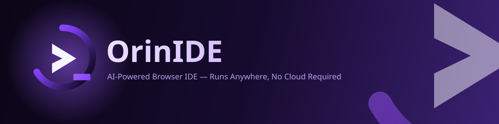
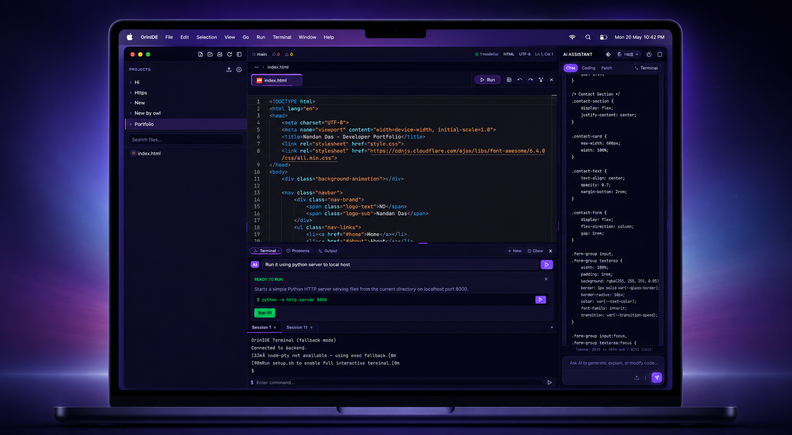
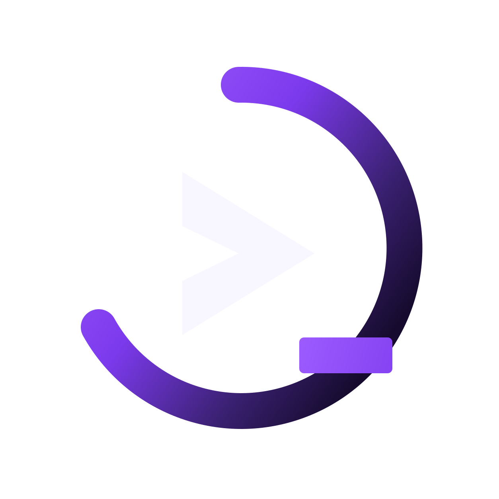

<div align="center">



**A full AI-augmented code editor that runs in your browser — terminal, file system, and multi-model AI, all local.**

[](https://www.npmjs.com/package/orin-ide)
[](https://www.npmjs.com/package/orin-ide)
[](https://nodejs.org)
[](./LICENSE)
[](https://github.com/nandandas2407-web/orin-ide)
[](https://openrouter.ai)

**[Docs](https://orinide.netlify.app) · [npm Package](https://www.npmjs.com/package/orin-ide) · [Report a Bug](https://github.com/nandandas2407-web/orin-ide/issues) · [Request a Feature](https://github.com/nandandas2407-web/orin-ide/issues)**

</div>

<br/>

## Table of Contents

- [What is OrinIDE?](#what-is-orinide)
- [Preview](#preview)
- [Quick Start](#quick-start)
- [Android / Termux Setup](#android--termux-setup)
- [Features](#features)
- [Keyboard Shortcuts](#keyboard-shortcuts)
- [AI Models](#ai-models)
- [Project Structure](#project-structure)
- [Security](#security)
- [Requirements](#requirements)
- [Contributing](#contributing)
- [License](#license)
- [Changelog](#changelog)

<br/>

## What is OrinIDE?

**OrinIDE** is a fully-featured, AI-augmented code editor that runs entirely in your browser — backed by a lightweight local Node.js server. There's no cloud account, no IDE subscription, and no upload of your code anywhere.

Run one command:

```bash
npx orin-ide
```

Open `localhost:3000`, and you have a complete coding environment — real terminal, full file system, multi-model AI chat, multi-agent AI collaboration, a diff viewer, and a lot more.

> Built by **[Nandan Das](https://orinide.netlify.app)** — runs on desktop, laptop, and even Android via Termux.

<br/>

## Preview

<div align="center">

<!--
  🎬 DEMO VIDEO
  Drop your exported clip in as `assets/preview.mp4` and it will play
  right here on GitHub, npm, and any Markdown viewer that supports
  inline <video>. The `poster` shows the preview.png screenshot as a
  thumbnail until the video is played.
-->
<video src="assets/preview.mp4" poster="assets/preview.png" width="800" controls muted playsinline>
  Your Markdown viewer doesn't support inline video — watch it here instead:
  <a href="assets/preview.mp4">assets/preview.mp4</a>
</video>

<p><sub>🎥 Demo video not attached yet — drop <code>preview.mp4</code> into <code>assets/</code> and it will show up here automatically.</sub></p>

<br/>

<a href="https://orinide.netlify.app">
  
</a>

</div>

<br/>

## Quick Start

```bash
# Zero install — run instantly
npx orin-ide

# Or install globally
npm install -g orin-ide
orin-ide

# Custom port
orin-ide --port 8080
```

Then open **[http://127.0.0.1:3000](http://127.0.0.1:3000)** in your browser.

<br/>

## Android / Termux Setup

Run OrinIDE directly on your Android phone using [Termux](https://termux.dev).

```bash
# 0. Enable storage access (IMPORTANT)
termux-setup-storage

# 1. Update packages + install Node.js
pkg update -y && pkg install nodejs-lts -y

# 2. Install OrinIDE
npm install -g orin-ide

# 3. (Optional) Install Python & C/C++ compiler support
bash $(npm root -g)/orin-ide/setup.sh

# 4. Start OrinIDE
orin-ide
```

Then open **http://127.0.0.1:3000** in your mobile browser.

<br/>

## Features

<details open>
<summary><strong>🤖 AI Assistant</strong></summary>
<br/>

| | |
|---|---|
| **Multi-Model AI Chat** | Chat with AI models via OpenRouter — DeepSeek, Gemini, GPT, Claude, Gemma, and more. |
| **Streaming Responses** | Real-time token-by-token streaming with auto-scroll and scroll-lock detection. |
| **Chat Modes** | Chat, Generate, Edit, Patch, and Explain — each mode tailors the AI's output format. |
| **Patch Mode** | AI outputs surgical `@@patch` diffs instead of full file rewrites. |
| **AI Continuation** | Auto-resumes from exactly where it left off if a response gets cut off — verified against the model's actual finish signal, not a guess, so it never silently hands you half a file. |
| **Project-Wide Context** | AI reads every file in your project before each message. |
| **System Prompt Engineering** | Format rules placed first for free-model compliance. |
| **Model Picker** | Switch models from the top bar. Shows token usage, context limits, and model health. |
| **Chat Sessions** | Multi-session system with tags, pin/unpin, rename, export/import, stats, and search. |
| **@Skill Mention** | Type `@` in chat for an autocomplete dropdown of all skills. |

</details>

<details>
<summary><strong>🕸️ Agentic Mode — Multi-Agent Collaboration</strong></summary>
<br/>

A team of four specialized AI agents work your request end-to-end, in sequence, each building on the last:

```
Architect  →  Coder  →  Reviewer  →  Integrator
 (plans)      (builds)   (audits)     (ships)
```

| | |
|---|---|
| **Autonomous Task Execution** | Hands a full multi-step build to the agent team — planning through implementation — with no micromanagement. |
| **Per-Agent Model Selection** | Assign a different model to each of the 4 roles from the config panel. |
| **Multi-Model Collaboration** | Each agent sees the previous agents' full output as context, budgeted to fit the model's window. |
| **Self-Healing Generation** | If any agent's step is cut off mid-file, it auto-continues from exactly where it stopped before handing off — so a truncated response never gets silently passed down the pipeline or applied to your project. |
| **Terminal-Aware** | Agents can emit `@@cmd:` shell commands (`npm install`, `git init`, etc.) — run individually or all at once, streamed live from a real shell. |
| **Session Memory** | Every collaboration is auto-saved as a session — rename, switch, or delete from the sessions panel. |

</details>

<details>
<summary><strong>🧠 AI Providers & Local Models</strong></summary>
<br/>

| | |
|---|---|
| **Multi-Provider Support** | OpenRouter, Anthropic, OpenAI, Groq, Together AI, Ollama (local), DeepSeek — all configurable. |
| **Bring Your Own Provider (BYOP)** | Add any OpenAI-compatible API endpoint. |
| **Local Model Support** | Run models locally via Ollama — TinyLlama, Mini models, and other lightweight LLMs. |
| **Seamless Model Switching** | Switch between local and cloud models on the fly. |
| **Custom API Endpoints** | Point to any OpenAI-compatible server — local or remote. |
| **Provider Health** | Monitor provider status and model availability from the settings panel. |

</details>

<details>
<summary><strong>🐞 AI Bug Fixer</strong></summary>
<br/>

| | |
|---|---|
| **Auto-Detect Errors** | AI-powered bug detection scans your code for issues. |
| **Explain Issues** | Plain-language explanations of what went wrong and why. |
| **Suggest Fixes** | Generates corrected code with explanations for each fix. |
| **Generate Corrected Code** | Produces ready-to-apply corrected code with full context. |

</details>

<details>
<summary><strong>✨ AI Inline Features</strong></summary>
<br/>

| | |
|---|---|
| **AI Explain on Hover** | Ctrl+Hover any word for a rich formatted tooltip with explanation. |
| **Lightbulb Actions** | AI-powered code actions in the editor gutter — Fix, Explain, Refactor, Optimize. |
| **AI Code Review** | Full-file review with inline severity-tagged comments. |
| **AI Refactor** | Select code, describe the change, get a diff-previewed refactor. |
| **Ghost Text Completions** | Inline AI completions as you type, Tab to accept. |
| **AI Commit Messages** | Generates a conventional commit message from your staged diff. |
| **Natural Language Terminal** | Describe what you want in plain English, get the shell command. |

</details>

<details>
<summary><strong>📁 File Management</strong></summary>
<br/>

| | |
|---|---|
| **File Explorer** | Complete project file tree — create, rename, move, delete files and folders. |
| **File Favorites** | Pin/unpin files to a Favorites section at the top of the file tree. |
| **Global Search** | Project-wide keyword search with case-sensitive, whole-word, and regex options. |
| **Find & Replace** | Cross-file find and replace with highlighted matches. |
| **ZIP Export / Import** | Export any project as a `.zip`, or import one instantly. |
| **Media Upload** | Drag-and-drop images, videos, and audio into your project. |
| **Quick Open** | `Ctrl+P` opens a fuzzy file search modal. |

</details>

<details>
<summary><strong>💻 Terminal</strong></summary>
<br/>

| | |
|---|---|
| **Real Terminal** | Fully interactive xterm.js shell — not a fake console. |
| **Multiple Sessions** | Persistent terminal sessions that survive page refresh. |
| **Session Bar** | Switch between terminal sessions with a session bar. |
| **Terminal Themes** | Terminal colors sync to match the editor theme. |

</details>

<details>
<summary><strong>🌿 Git Integration</strong></summary>
<br/>

| | |
|---|---|
| **Source Control Panel** | Shows branch name, staged/unstaged/untracked files. |
| **Stage / Unstage** | Stage or unstage individual files or all at once. |
| **Commit** | Commit with message (`Ctrl+Enter`). |
| **Push / Pull** | Push and pull with status feedback. |
| **Git Init** | Initialize a new repository. |
| **Auto-Refresh** | Git sidebar auto-refreshes when it becomes visible. |

</details>

<details>
<summary><strong>🎨 UI & Experience</strong></summary>
<br/>

| | |
|---|---|
| **Dark Purple Theme** | Deep-purple, cyberpunk-inspired UI. |
| **Drag-to-Resize Panels** | Resize sidebar, chat panel, agents panel, and terminal by dragging. |
| **Sidebar Positioning** | Dock the Explorer and AI Chat to the left or right independently. |
| **Command Palette** | `Ctrl+Shift+P` opens a searchable command palette. |
| **Voice Commands** | Web Speech API for voice-driven IDE actions. |
| **Live Preview** | Opens an iframe-based live preview of the project's `index.html`. |
| **Diff Viewer** | Review AI edits line-by-line in split or unified view. |
| **Responsive Layout** | Fully responsive — works on desktop, tablet, and mobile. |
| **Mobile Navigation** | Tab bar, FAB menu, and touch-optimized controls for Android. |

</details>

<br/>

## Keyboard Shortcuts

| General | Editor | AI Features | Navigation | Terminal |
|---|---|---|---|---|
| `Ctrl+P` Quick Open | `Ctrl+D` Select next occurrence | `Ctrl+Shift+I` Toggle AI completions | `Ctrl+Shift+F` Search sidebar | `` Ctrl+` `` Toggle terminal |
| `Ctrl+Shift+P` Command Palette | `Ctrl+/` Toggle comment | `Ctrl+Shift+R` Toggle AI code review | `Ctrl+Shift+G` Git sidebar | `Ctrl+Shift+C` Copy selection |
| `Ctrl+S` Save file | `Shift+Alt+F` Format document | `Ctrl+Shift+E` AI refactor selection | `Ctrl+Shift+S` Snippet Palette | `Ctrl+Shift+V` Paste |
| `Ctrl+W` Close tab | `Ctrl+\` Split editor | `Ctrl+Hover` AI explain on hover | `Ctrl+Shift+H` Find & Replace | |
| `Ctrl+N` New file | `Ctrl+G` Go to line | `Ctrl+L` Toggle AI Chat panel | | |
| `Ctrl+B` Toggle sidebar | `F12` Go to definition | `Ctrl+Shift+A` Toggle AI Agents panel | | |
| `Ctrl+,` Open Settings | | | | |
| `Ctrl+K` Shortcuts Panel | | | | |

<br/>

## AI Models

All models below are available on the [OpenRouter](https://openrouter.ai) free tier unless noted:

| Model | Type | Notes |
|---|---|---|
| `openrouter/auto` | Auto | Auto-selects best free model (default) |
| Poolside Laguna xs.2 | Free | Fast coding-focused model |
| GLM-4.5 Air | Free | Z-AI free model |
| Tencent HY3 | Free | Preview model |
| GPT-OSS 120B | Free | OpenAI open-weights model |
| Nvidia Nemotron 120B | Free | Powerful free model |
| Google Gemma 3 27B | Free | Google's open model |
| Cohere North Mini Code | Free | Free coding model |
| DeepSeek V4 Pro | Paid | Best overall for code |
| GPT-5.5 | Paid | OpenAI flagship |
| Claude Opus 4.6 | Paid | Anthropic flagship |

You can also enter **any custom OpenRouter model ID** directly in the settings panel.

<br/>

## Project Structure

```
orin-ide/
├── backend/
│   ├── server.js                  # Express server + WebSocket + AI proxy
│   ├── routes/
│   │   ├── files.js               # File system API + surgical patch endpoint
│   │   ├── terminal.js            # PTY terminal over WebSocket
│   │   ├── export.js              # ZIP export, Termux export
│   │   └── preview.js             # Live preview route
│   └── services/
│       ├── terminalManager.js     # PTY session management
│       └── watcherManager.js      # File change watcher (chokidar)
├── frontend/
│   └── public/
│       ├── index.html             # Main app shell + splash screen
│       ├── assets/
│       │   ├── logo-mark.svg      # Full OrinIDE logo
│       │   ├── logo-icon.svg      # 24px compact logo
│       │   └── favicon.svg        # Browser favicon
│       ├── css/                   # 9 modular stylesheets
│       │   ├── main.css           # Core layout, variables, splash
│       │   ├── sidebar.css        # Explorer, file tree, git panel
│       │   ├── editor.css         # Editor, tabs, diff viewer
│       │   ├── terminal.css       # Terminal panel
│       │   ├── chat.css           # AI chat panel
│       │   ├── modals.css         # All modal dialogs
│       │   ├── mobile.css         # Mobile responsive
│       │   ├── agents.css         # AI Agents panel
│       │   └── overrides.css      # Fine-tuning overrides
│       └── js/                    # 44 feature modules
│           ├── app.js             # Main bootstrap + boot sequence
│           ├── api.js             # API client + AI proxy
│           ├── editor.js          # Monaco Editor manager
│           ├── chat.js            # AI Chat with streaming
│           ├── utils.js           # Utilities, parseFiles, parsePatches, renderMD
│           ├── theme.js           # 4 editor themes with token rules
│           ├── aiexplain.js       # AI explain on hover
│           ├── ainline.js         # Lightbulb, long-press, context menu
│           ├── aireview.js        # AI code review
│           ├── airefactor.js      # AI refactor inline
│           ├── aicodeactions.js   # AI code actions provider
│           ├── agents.js          # Multi-agent collaboration
│           ├── aiterminal.js      # Natural language to shell
│           ├── aicommit.js        # AI commit messages
│           ├── aicompletions.js   # Ghost text completions
│           ├── filetree.js        # File explorer
│           ├── fileicons.js       # 40+ file type icons
│           ├── terminal.js        # xterm.js terminal
│           ├── termthemes.js      # Terminal color themes
│           ├── voicecommands.js   # Voice commands
│           ├── voice.js           # Voice input for chat
│           ├── skills.js          # Skills system
│           ├── features.js        # Chat sessions manager
│           ├── snippet*.js        # Snippet engine + palette
│           ├── shortcuts.js       # Shortcuts panel
│           ├── favorites.js       # File favorites
│           ├── breadcrumb.js      # Breadcrumb navigation
│           ├── spliteditor.js     # Split editor
│           ├── gitdiff.js         # Git diff decorations
│           ├── git-mgr.js         # Git source control panel
│           ├── cmdpalette.js      # Command palette
│           ├── quickopen.js       # Quick open file search
│           ├── providers.js       # AI provider configs
│           ├── preview.js         # Live preview
│           ├── media.js           # Asset upload
│           ├── imageapi.js        # Free image API
│           ├── resizer.js         # Panel drag-to-resize
│           ├── global-search.js   # Global search
│           ├── sidebar-position.js # Sidebar docking
│           ├── autosave-indicator.js # Dirty state indicator
│           ├── vibe.js            # Diff viewer, code snapshots, startup
│           └── orin_patches.js    # Final patches + provider setup
├── bin/
│   ├── orin-ide.js                # CLI entry point
│   └── postinstall.js             # Post-install message
├── assets/
│   ├── logo-mark.svg              # Full logo (root copy)
│   ├── preview.png                # Project preview screenshot
│   └── preview.mp4                # Demo video (add your own)
├── setup.sh                       # Termux dependency installer
└── package.json
```

<br/>

## Security

Version `1.0.5`+ includes a full security hardening pass:

- Path traversal protection on all export routes via `safeProjectName()` validation
- `Content-Disposition` header injection fixed
- `targetDir` restricted to an allowlist of safe roots on Termux export
- `localOnly` middleware added to all routes
- WebSocket connection limit (max 10 simultaneous clients)
- Broadened `rm` ban pattern to catch all dangerous variants
- `multer` upgraded to `^2.0.0` — resolves 7 high-severity CVEs from `1.x`
- `archiver` upgraded to `^7.0.1` — removes deprecated transitive dependencies

<br/>

## Requirements

| | |
|---|---|
| **Node.js** | `>= 18.0.0` |
| **API Key** | [OpenRouter](https://openrouter.ai) (free tier available) for AI features |
| **Browser** | Any modern browser — Chrome, Firefox, Edge, Brave |

<br/>

## Contributing

Contributions, issues, and feature requests are welcome.

1. Fork the repo
2. Create a feature branch — `git checkout -b feat/your-feature`
3. Commit your changes — `git commit -m "feat: add your feature"`
4. Push to the branch — `git push origin feat/your-feature`
5. Open a Pull Request

Please check the [issues page](https://github.com/nandandas2407-web/orin-ide/issues) before opening a new one.

<br/>

## License

**MIT** © 2026 [Nandan Das](https://orinide.netlify.app) — [nandandas2407@gmail.com](mailto:nandandas2407@gmail.com)

See [LICENSE](./LICENSE) for full terms.

<br/>

## Changelog

<details open>
<summary><strong>v1.0.8 — Local AI Models, Agentic Mode, Bug Fixer, UI Redesign</strong></summary>

**Local AI Model Support**
- Integrated local model execution directly inside Orin IDE via Ollama
- Support for running Ollama models, TinyLlama, Mini models, and other lightweight local LLMs
- Install, manage, and run local models directly from the IDE without leaving the workspace

**Agentic Mode**
- New Agentic Mode for autonomous and multi-step task execution
- Multiple mini AI models work together for improved reasoning and task completion
- Intelligent orchestration between models for coding, debugging, and assistance
- Phase-based workflow: Thinking → Planning → Coding → Integrating → Done
- Fixed a crash that could stop the agent pipeline after the first step
- Agents now auto-recover from a cut-off response before handing off to the next agent

**AI Bug Fixer**
- AI-powered bug detection that scans code for issues
- Suggests fixes with explanations for each detected problem
- Generates corrected code ready to apply

**Extensible AI Ecosystem**
- Bring-your-own-provider (BYOP) support — use any OpenAI-compatible API
- Custom API endpoints and self-hosted AI services fully supported
- Flexible configuration system for developers and power users
- Seamless switching between local and remote models

**UI & UX Enhancements**
- Complete UI redesign and visual improvements
- Enhanced animations, layouts, and micro-interactions
- Improved accessibility across the entire IDE
- Better responsiveness and overall user experience

**Accessibility & Integration**
- Unified AI experience across editor, terminal, and assistant panels
- AI features accessible throughout the IDE
- Keyboard-first design — every feature accessible via shortcuts

</details>

<details>

**Patch Mode**
- Patch button in top bar and extras popup — forces AI to output only `@@patch` diffs
- Dedicated patch-only system prompt with zero file creation instructions
- Full file content sent in user message for maximum AI context
- 4-strategy auto-converter catches AI output in any format
- LCS-based diff engine finds ALL changed regions
- Backend fuzzy matching for resilient patch application

**AI Continuation System**
- Auto-chains when generation is incomplete, verified against the model's real finish reason
- Up to 10 continuations with minimal, bounded context per continue
- Stop button kills the continuation loop
- Fallback "Save to Project" panel when continuation fails

**System Prompt Improvements**
- Format rules placed first for free model compliance
- Shorter, more direct prompts
- Free model context limits corrected to 16384 tokens

**Bug Fixes**
- `DiffViewer.captureOrig()` crash fixed
- False-positive Continue button eliminated
- Patch apply backend now handles CRLF, tabs, trailing whitespace via fuzzy matching
- Removed a duplicate continuation handler that ignored the continue limit and could exhaust the model's context window on long sessions

</details>

<details>
<summary><strong>v1.0.7 — Project-Wide AI Context, Surgical Edits, Skills System & More</strong></summary>

**New Features**
- **Project-Wide AI Context** — AI reads every file in your project before each message
- **Surgical AI Edits** — `@@patch:` format for targeted changes without full rewrites
- **Skills System** — Expert AI behavior presets with @mention autocomplete
- **HTML Preview in Chat** — Live preview button on every HTML code block
- **Free Image API** — 20+ categories from Picsum Photos and LoremFlickr
- **Image Picker** — Visual grid browser for stock images
- **Smart Portfolio Generation** — Real image URLs injected into AI prompts

**Bug Fixes**
- Diff viewer blank screen fixed
- Code block header layout fixed
- Streaming render fix with requestAnimationFrame batching
- Auto-scroll pause on manual scroll during streaming

</details>

<details>
<summary><strong>v1.0.6 — Security Hardening</strong></summary>

Full security audit and hardening release. See the [Security](#security) section for details.

</details>

<br/>

<div align="center">

<br/>

**Built with care by [Nandan Das](https://orinide.netlify.app)**


</div>
